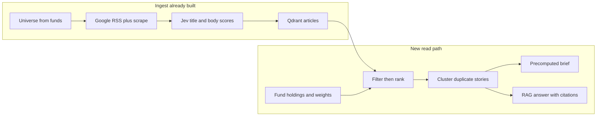

# Investor insight product (ideas, not a build spec)

Today the repo ends at Qdrant: one point per URL, a 384-d vector of title plus the start of the body, and a payload of Jev scores (`entity_names`, impact, direction, event type). That is a **research index**. An investor product needs a **second system** that turns those articles into “what this means for this fund.”

RAG fits that second system. It should not replace the pipeline, and it should not be “embed the question, take top 20 vectors, ask an LLM.” Finance insights fail when similarity outranks **portfolio weight, recency, and whether the body is actually about the holding**.

## What the investor should get

Three products, same corpus:

- **Morning brief per fund.** Overnight stories that touch holdings or sectors, ordered by how much of the fund they touch, not by how many headlines exist. One paragraph per real-world event, with links.
- **Holding or sector card.** “HDFC this week”: direction, event type (results vs opinion vs regulatory), and whether several articles agree.
- **Ask a question (RAG).** “Did anything on RBI liquidity hit my banking weight?” Answer only from retrieved articles, each claim tied to a URL.

Precompute the brief on a schedule. Use RAG only for questions you did not precompute. Generating a summary on every page view wastes Jev or LLM cost and makes answers drift.

## RAG: yes, but hybrid

Retrieval order that matches data you already store:

1. **Who.** Intersect article `entity_names` / `industry_names` with the fund’s holdings and sectors. This is a payload filter, not a vector search.
2. **When.** `published_at` inside the window the investor cares about (last night, 7 days).
3. **How material.** Prefer `max_impact` and `max_relevance` you already scored. Drop `price_recap` and low impact unless the user asks for noise.
4. **Then vectors.** `semantic_search` only inside that filtered set, for the user’s wording (“CEO succession”, “rate hike”). Cosine on the whole corpus will surface a similar article about the wrong company.
5. **Cluster before the LLM.** Eight URLs about the same RBI auction are one event. Summarize the cluster, cite 2–3 sources. Otherwise the model repeats headlines.
6. **Generate with a fixed shape.** What happened, which holdings or sector weights it touches, direction, what is opinion vs a new fact (`event_type` already distinguishes these), sources. If retrieval is empty, say so. Do not let the model fill gaps from memory.
7. **Store the brief.** A short insight record (fund, date, event id, text, source URLs) so the app can show yesterday’s brief and so you can evaluate quality. Optional: embed the brief later so “what did we tell investors last week” is searchable. Do not embed fund portfolios into Qdrant.

Chunking the full `scraped_text` into many vectors is a later upgrade, not the first RAG. The current one-vector-per-article design is enough once filters and clustering exist. Chunks help only when the important fact is buried past the first 1500 characters.

Keyword or sparse search on titles is worth adding beside BGE. Names, “VRRR”, “GST 2.0” are exact; dense search is fuzzy.

## Multiple funds (do this in a normal database, not in the vector)

You already aggregate all ISINs into one popularity ranking and search only the top 5 holdings and 5 sectors. That cannot answer “this investor’s fund.”

Split the data:

- **Article store (Qdrant, shared).** Unchanged idea: one canonical URL, many entity tags. Every fund reads the same news.
- **Fund store (Postgres or similar).** ISIN, name, as-of date, holdings `{instrument_name, weight_pct, industry}`. You already get this from `GET /api/v1/app/fund/{ISIN}`.
- **Join at read time.** Article tags match holding names. Insight weight is `portfolio % × impact`, not `fund_count` on the article. Removing `fund_count` from the payload was the right call; the count belongs on the fund snapshot, which changes.

Universe for ingest should become the **union of holdings that matter**, not “top 5 in the whole market”:

- Any name above a weight cutoff in at least one fund you serve (for example 2%).
- Sectors that are a large slice of those funds, not only sectors that have a hand-written `SECTOR_QUERIES` entry.
- A small macro query you already have (RBI, budget, flows), because it moves many funds even when no company is named.

Searching every holding of every fund every day will explode Google and Jev cost. Cap by **material weight**, refresh the union daily, and skip URLs already in Qdrant (you already do that).

Per-fund output is then cheap: same articles, different join and ranking. One article about HDFC is a big insight for a fund that is 8% HDFC and a footnote for a fund that is 0.4% HDFC.

## Parallelization (ingest, not the LLM answer)

Already parallel: Google fetch (`fetch_workers`) and scrape (`scrape_workers`). Still serial: **one Jev title call per entity**, then **one Jev body call per URL** ([jev_titles.py](news_pipeline/graph/nodes/jev_titles.py), [jev_articles.py](news_pipeline/graph/nodes/jev_articles.py)). That is the wall when the universe grows from 10 names to hundreds.

Safe to parallelize:

- Title Jev across entities (each call is independent).
- Body Jev across URLs (each call is independent).
- Embed batches you already batch; upserts are idempotent because the point id is UUID5 of the URL.

Do not parallelize blindly:

- Jev rate limits and cost. Use a small worker pool plus retries, not one thread per entity.
- Title dedupe that reads “recent titles for this entity” from Qdrant. Parallel writers can double-store near-duplicate headlines unless dedupe stays per entity or moves to a queue with a lock per entity name.
- Fresh-start “delete the whole collection” must stay off in production (Cloud workflow already sets that). Parallel jobs assume the collection is append-only.

Production shape when this is daily and multi-fund: a job queue (fetch → title → scrape → score → embed) instead of one linear LangGraph process. The graph can stay the logic; workers pull stages. Failures retry per URL, not by rerunning the world.

RAG answers can also be parallel (one brief per fund after the shared retrieve), but that is cheap next to ingest.

## Other production ideas worth doing before more models

- **Events, not articles, as the unit of insight.** Cluster by fuzzy title plus same entities plus same day. The investor reads events.
- **Agreement.** If two sources disagree on direction, say so. You already store `direction` per entity.
- **Alerts vs digest.** Impact 3 or a large weighted holding gets a push. Impact 1 waits for the morning note.
- **Eval set.** A few dozen labeled URLs: should this be about HDFC, what impact, was the brief faithful. Otherwise RAG quality is vibes.
- **Citations and a non-advice line.** Every sentence that states a fact points at a publisher URL. The product is research context, not a buy or sell.
- **Stale holdings.** Fund weights need an as-of date. A rebalance should change tomorrow’s brief without re-embedding old news.
- **Scrape and source health.** Per-publisher failure rates in the run log you already write. A dead scraper silently empties the brief.
- **Cost dashboard.** You already track Jev tokens. Add “cost per stored article” and “cost per fund brief” before widening `holdings_limit`.

## Order that keeps the project shippable

1. **Fund snapshot store and join.** Prove one fund brief from existing Qdrant points using filters and weights, no new embeddings.
2. **Event clustering and a written brief template** with citations. This is the investor-facing MVP.
3. **Hybrid RAG** for ad-hoc questions on that same filtered set.
4. **Widen the ingest universe** using material weights across many funds, with parallel Jev under a rate limit.
5. **Queue, retries, eval, alerts** once more than one fund depends on the morning run.

Do not start by chunking every article or by putting fund portfolios into Qdrant. The missing piece is portfolio-aware retrieval and a grounded summary, not a bigger vector.