# Next-Generation RAG Architecture: Two-Tier Portfolio Intelligence Engine

## 1. Executive Summary & Problem Statement

### The Problem
The current on-demand Mutual Fund RAG pipeline faces two core bottlenecks:
1. **High Latency (10–25s)**: When a user clicks a fund on `/fund-search`, the engine sequentially queries Qdrant/BM25 for 10–30 holdings and sectors, parses dozens of raw chunks, and sends high-token payloads to the LLM.
2. **Redundant Repetitive Work**: 500+ different mutual funds often hold identical top stocks (*HDFC Bank, Reliance, ICICI Bank, Infosys*). Processing these individually per fund request creates massive compute and token redundancy.
3. **Siloed Stock Outputs**: The current brief generates isolated stock-by-stock bullets rather than an overarching macroeconomic and cross-sector portfolio narrative.

### The Solution: Two-Tier Architecture
- **Tier 1 (Morning Batch Pre-computation)**: During the daily news ingestion run (06:00 UTC), generate and cache high-density, structured **Daily Micro-Insights** for the top 100 holdings and top 15 sectors.
- **Tier 2 (Sub-Second Portfolio Synthesis)**: On `/fund-search`, instantly retrieve pre-computed micro-insights (0ms lookup) and execute a single lightweight **Multi-Asset Synthesis LLM** call to weave macro, sector, and stock drivers into a unified investment story.

---

## 2. System Architecture & Data Flow

```mermaid
flowchart TD
    subgraph Tier1 ["Tier 1: Daily Ingestion & Micro-Insight Pre-computation (Morning Batch)"]
        A[News RSS / Web Ingestion] --> B[Jev Gate 1 & Gate 2 Filtering]
        B --> C[(Qdrant Vector DB / Embeddings)]
        C --> D[Micro-Insight Generator Node]
        D --> E[(data/daily_micro_insights.json Cache)]
    end

    subgraph Tier2 ["Tier 2: Fast Multi-Asset Portfolio Synthesis (On-Demand /fund-search)"]
        F[User Selects Mutual Fund ISIN] --> G[Load Fund Scope: Asset Weights, Top Holdings, Top Sectors]
        G --> H{In Micro-Insights Cache?}
        H -- Yes: Top 100 Stock / Top 15 Sector --> I[Instant 0ms Cache Hit]
        H -- No: Niche Small-Cap Holding --> J[Fallback: On-Demand Qdrant Vector Retrieval]
        I --> K[Assemble Fact-Dense Portfolio Context]
        J --> K
        K --> L[Multi-Asset Synthesis LLM]
        L --> M[Instant Unified Fund News Brief < 1.5s]
    end
```



---

## 3. Detailed Component Design

### Tier 1: Daily Micro-Insights Generator

#### Execution Trigger
Runs automatically as the final stage of `news_pipeline` (in GitHub Actions CI/CD or local scheduled runs) immediately after Qdrant upserting.

#### Scope
- **Universe**: Top 100 holdings (covers ~75–80% of all Indian equity fund AUM) + Top 15 sectors.
- **Target Extraction**:
  - Filter Gate-2 approved articles from the last 24–48 hours.
  - Extract material corporate actions, earnings surprises, regulatory/tax updates, and strategic expansions.
  - Tag directional market impact (`Positive`, `Negative`, `Neutral`, `High Risk`, `Growth Catalyst`).

#### Schema: `data/daily_micro_insights.json`
```json
{
  "updated_at": "2026-09-28T06:30:00Z",
  "version": "2.0",
  "holdings": {
    "HDFCBANK": {
      "name": "HDFC Bank Ltd",
      "headline": "Deposit growth accelerates while NIM stabilizes above 3.5%",
      "sentiment": "Positive",
      "impact_type": "Earnings & Margins",
      "key_points": [
        "Advances grew **14.2% YoY** led by strong retail and commercial banking demand.",
        "Branch expansion strategy yields lower cost of funds across semi-urban clusters."
      ],
      "source_articles": ["doc_id_101", "doc_id_104"]
    },
    "RELIANCE": {
      "name": "Reliance Industries Ltd",
      "headline": "Retail margins expand as telecom tariff hikes lift cash flows",
      "sentiment": "Positive",
      "impact_type": "Strategic Growth",
      "key_points": [
        "Jio ARPU increases to **Rs 195** following national tariff revisions.",
        "Commissioning of 20GW solar module manufacturing line ahead of timeline."
      ],
      "source_articles": ["doc_id_205"]
    }
  },
  "sectors": {
    "Financial": {
      "headline": "Credit growth remains buoyant amid benign NPAs and stable rate regime",
      "sentiment": "Positive",
      "key_points": [
        "Systemic bank credit grew **13.8% YoY** with gross non-performing assets at decade lows.",
        "RBI liquidity management keeps short-term funding spreads tight."
      ]
    },
    "Automobile": {
      "headline": "GST 2.0 cuts ignite festive utility vehicle sales surge",
      "sentiment": "Positive",
      "key_points": [
        "Passenger vehicle wholesales crossed **4,00,000 monthly units** post tax revisions.",
        "EV adoption in two-wheelers reached **10.68%** market share."
      ]
    }
  }
}
```

---

### Tier 2: Multi-Asset Portfolio Synthesis Engine

#### Objective
Instead of presenting a laundry list of detached stock bullets, the engine synthesizes the fund's **weighted portfolio allocation** with current macroeconomic drivers.

#### Synthesis Dimensions
1. **Macro & Sector Thematic Tailwinds/Headwinds**:
   - Analyzes how macroeconomic trends (e.g. interest rates, crude prices, inflation, GST revisions) interact with the fund's heavy sector bets (e.g., 38% Financials + 16% Auto).
2. **Top Asset Catalyst Integration**:
   - Connects individual holding movements to overall fund performance (e.g., *"Fund's 9.2% stake in HDFC Bank benefits directly from retail credit expansion..."*).
3. **Cross-Asset Correlation & Risk Exposure**:
   - Flags concentration risks or sector vulnerabilities (e.g., sensitivity to IT discretionary spending or crude oil fluctuations).
4. **Quiet/Under-the-Radar Holdings**:
   - Notes top holdings with no material news in the past 48 hours, indicating stable operational continuity.

---

## 4. Prompt Template for Portfolio Synthesis

```text
You are a senior Chief Investment Officer (CIO) and Portfolio Strategist at a leading asset management firm.
Your audience is a retail investor looking for a clear, high-level, story-driven explanation of how current news impacts their Mutual Fund.

FUND METADATA:
- Fund Name: {fund_name}
- Category: {category} | Benchmark: {benchmark}
- Top Sector Allocation: {top_sectors_with_weights}
- Top 5 Holdings: {top_holdings_with_weights}

PRE-COMPUTED MARKET & ASSET INTELLIGENCE:
[SECTOR DYNAMICS]
{sector_micro_insights}

[TOP HOLDING CATALYSTS]
{holding_micro_insights}

TASK & INSTRUCTIONS:
1. Synthesize a unified investment narrative connecting macroeconomic conditions, top sector drivers, and the fund's largest holdings.
2. Structure your response into:
   - **Executive Narrative**: 2-3 concise paragraphs (ELI5 storytelling style) explaining the core momentum and sector drivers.
   - **Key Portfolio Takeaways**: 3-5 structured bullet points highlighting the biggest market catalysts.
   - **Risk & Sensitivity Note**: 1 brief highlight on what could challenge this fund's top bets (e.g. rates, commodities, global demand).
3. Use **bold** badges for key numbers, percentages, company names, and policies.
```

---

## 5. Fallback & Graceful Degradation Strategy

| Scenario | Resolution Mechanism |
| :--- | :--- |
| **Top 100 Holding** | Instant cache hit (`data/daily_micro_insights.json`) — **0ms lookup**. |
| **Niche / Small-Cap Holding** | Direct scoped vector retrieval from Qdrant for that specific entity (<200ms). |
| **Zero News for Holding** | Automatically assigned to the *"Quiet Holdings (No High-Impact News)"* badge. |
| **Cache Missing / Expired** | Fall back to standard hybrid RAG retrieval without breaking the endpoint. |

---

## 6. Execution & Implementation Roadmap

### Phase 1: Micro-Insight Ingestion Generator
- [ ] Create `news_pipeline/graph/nodes/generate_micro_insights.py`.
- [ ] Implement batch extraction targeting top `holdings_limit` (100) and `sectors_limit` (15).
- [ ] Output structured results to `data/daily_micro_insights.json`.
- [ ] Add the node to `news_pipeline/graph/pipeline.py` and GitHub Actions workflow.

### Phase 2: Synthesis Engine & RAG Overhaul
- [ ] Create `news_rag/micro_cache.py` for fast in-memory loading with timestamp validation.
- [ ] Refactor `news_rag/fund_brief.py` to assemble context from micro-insights.
- [ ] Update the synthesis prompt in `news_rag/generation.py` for multi-asset macro narrative generation.
- [ ] Implement graceful fallback to Qdrant for holdings outside the top 100.

### Phase 3: UI & Performance Polish
- [ ] Ensure `/fund-search` renders the new Macro & Sector Narrative cards.
- [ ] Verify response time benchmarks (< 1.5 seconds end-to-end).
- [ ] Add automated regression tests validating fund brief generation for Large Cap, Mid Cap, and Sectoral/Thematic funds.

---

## 7. Expected Performance Gains

| Metric | Current On-Demand RAG | Two-Tier Synthesis Engine | Improvement |
| :--- | :--- | :--- | :--- |
| **End-to-End Latency** | 12 – 25 seconds | **0.8 – 1.8 seconds** | **~90% Faster** |
| **Qdrant Vector Queries / Click** | 10 – 30 queries | 0 queries (cache hit) | **100% DB Load Reduction** |
| **LLM Token Consumption / Click** | 6,000 – 15,000 tokens | 1,200 – 2,000 tokens | **~75% Cost Reduction** |
| **Insight Cohesion** | Fragmented stock bullets | Unified Macro-to-Micro Story | **Significantly Higher Quality** |